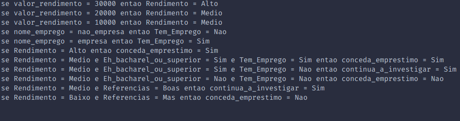
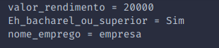
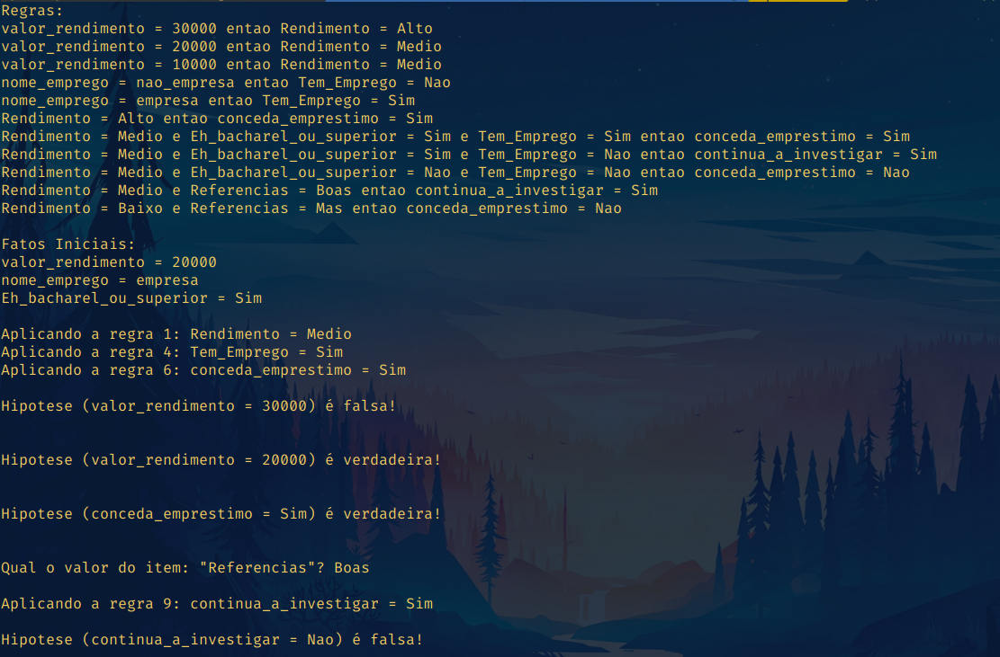

# Lista 1 de I.A (IC-UFAL)

Aluno: João Victor de Alarcão Ayalla Alcântara

## Formato do input

Para o conjunto de regras, as seguintes condições precisam ser atendidas:

- As regras devem estar contidar no arquivo rules.txt (dentro da pasta input)
- Uma regra por linha
- Uma regra deve iniciar pela palavra reservada "se" seguido de uma ou mais condições
- Cada condição tem a forma: "X = Y", sendo X e Y palavras representando chave e valor respectivamente
- As condições devem ser concatenadas utilizando a palavra reservada "e"
- Por último deve vir a palavra reservada "entao" seguido de uma expressão da forma: "X = Y", sendo X e Y palavras representando chave e valor respectivamente
- Cada palavra deve estar separada por espaços
- Uma palavra não deve conter espaços
- As regras são indexadas a partir do 0

Para o conjunto de fatos, as seguintes condições precisam ser atendidas:

- Os fatos devem estar contidos no arquivo facts.txt (dentro da pasta input)
- Um fato por linha
- Um fato tem a forma: "X = Y", sendo X e Y palavras representando chave e valor respectivamente

# Execução

Para a execução, deve se executar o arquivo main.py da pasta selecionada, através do comando 'python3 main.py'. Cada pasta contém uma estratégia de encadeamento.

Encadeamento para frente:

Encadeamento para trás:

